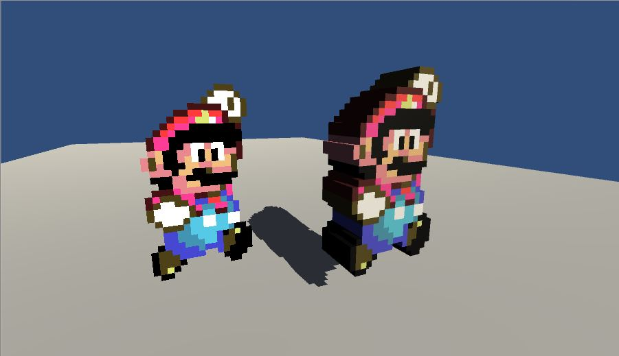
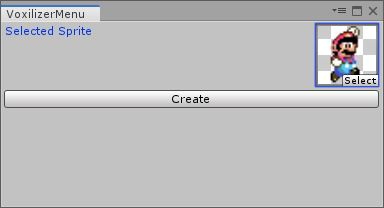

# Unity Sprite Voxelizer

Convert 2D sprites into 3D voxel meshes in Unity.

## How to use it

Download or clone this repository to your Unity project

Open the Voxelizer menu by going to `Window/Voxelize Sprite`. Select a sprite to voxelize.

**Warning**: ensure that read/write is enabled in the sprite's Import Settings

For best results, set sprite compression format to RGBA32 before converting
